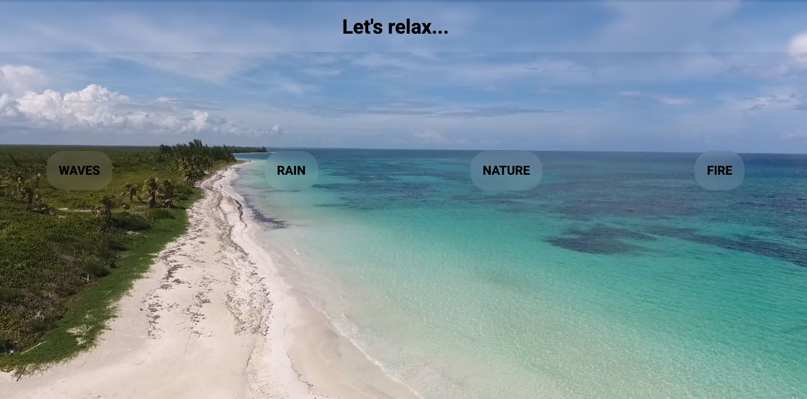

<h1 align="center">🌿 Relaxing App</h1>

<strong>Relax. Focus. Recharge.</strong>

  
  
  
  

  A minimal relaxation timer app with calming nature sounds — built using HTML, CSS, and JavaScript.
   
  <em>Take a mindful break, breathe deeply, and let nature help you reset. 🌊🌧🔥🌲</em>

---

## 🎧 Features

- 🕒 Custom timer options — 5, 10, or 15 minutes  
- 🌊 Ambient sounds — *ocean, forest, rain, fire*  
- 🎚️ Smooth fade-in / fade-out audio transitions  
- 🔄 Animated circular progress ring  
- ⏯️ Start / Pause / Reset functionality  
- 🌈 Clean and calming user interface   

---

## 💡 How to Use

1. Open the app in your browser (`index.html`)  
2. Choose a relaxing sound (ocean, forest, rain, fire)  
3. Set the timer (5, 10, or 15 minutes)  
4. Press **Start** and relax 🌸  

---

## 🌐 Demo

  

  Experience calmness right in your browser 🌿

---

## 📸 Preview

  

---

## 🧘‍♀️ Inspiration

Created to bring a moment of peace to your day.  
Take a break, breathe deeply, and let nature do the rest 🌿  

---

### © 2025 Nataliia Litskevych
